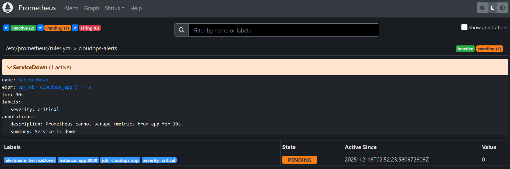
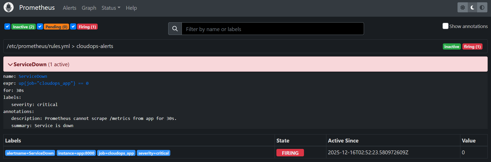
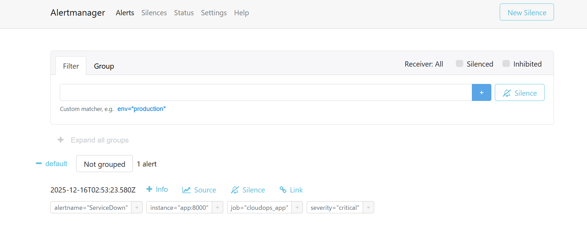
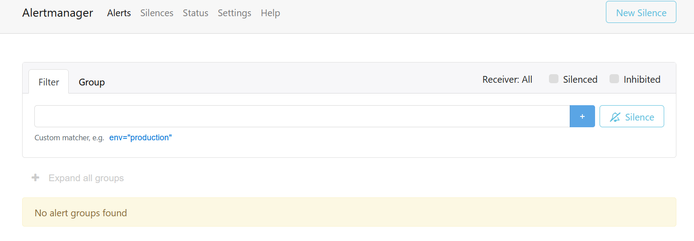
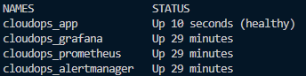

# cloudops-automation-lab
A small but production-minded lab project to demonstrate:
- IaC mindset (reproducible setup)
- Observability (Prometheus / Grafana)
- Alerting pipeline (Prometheus rules -> Alertmanager)
- Incident operation (Runbook + Postmortem)
- Preventative hardening (healthcheck + auto-restart)


## Evidence (Screenshots)

### ServiceDown: Pending → Firing → Resolved





### Healthcheck


 
## Quick Start
```powershell
docker compose up -d --build
